# M5Stack CO2 Monitor

このページはSwitchScienceで委託販売中の「[M5Stack用CO2モニターキット](https://www.switch-science.com/catalog/6923/)」（以下、本キット）のサポートページです。

本キットをM5Stackに接続し、このリポジトリのアプリケーションソフトウェアをM5Stackに書き込むことで、二酸化炭素濃度・温度・湿度を計測、表示することができます。  
二酸化炭素濃度の時系列はM5Stack上でグラフで確認することができます。

また、[Ambient](https://ambidata.io/)によるログ保存・表示、[Pushbullet](https://www.pushbullet.com/)による濃度レベルに応じたスマホやPCへのプッシュ通知ができます。（Wifi環境、別売りのmicroSDカードが必要）

M5Stack Basic, M5Stack Grayでの動作を確認しています。

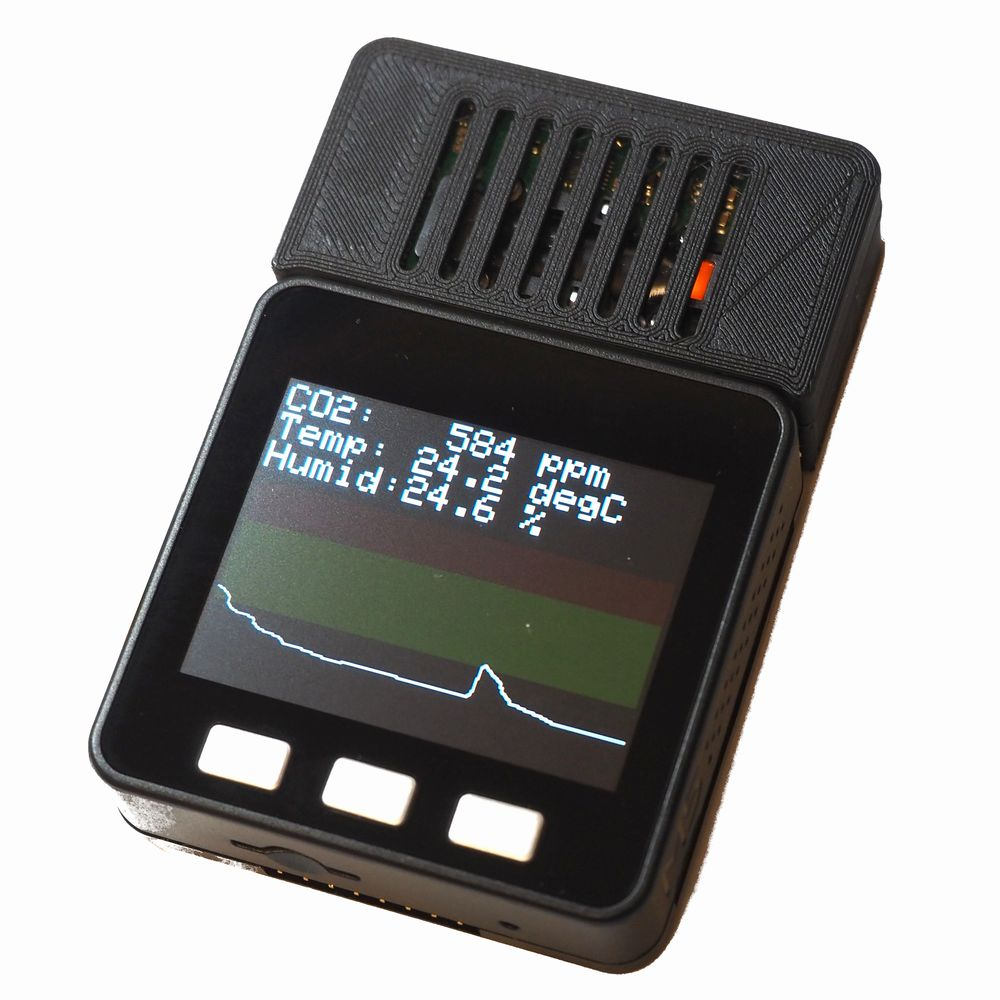

## 更新履歴
| Version |    日付    | 更新内容                                                                                           |
| :-----: | :--------: | :------------------------------------------------------------------------------------------------- |
|   3.3   | 2021/04/08 | Arduino core for the ESP32 1.0.5以降＋Arduino IDEで書き込むと正常に起動できない問題を修正          |
|   3.2   | 2021/04/07 | 長押しで設定画面に遷移するよう修正<br>設定画面で無入力のまま一定時間経つとメイン画面に戻るよう修正 |
|   3.1   | 2021/03/25 | Arduino core for the ESP32 1.0.5に更新するとWifiClientSecureでPushbulletに接続できない問題を修正   |
|   3.0   | 2021/2/11  | First Release                                                                                      |

# 必要なもの
本キットを使ったCO2モニタの製作には、別途[M5Stack Basic](https://www.switch-science.com/catalog/3647/)が必要です。（別売）  
また、長時間の計測を行う場合は、M5Stackに電源を接続して使用することをおすすめします。

アプリケーションソフトウェアの書き込みには、別途以下のライブラリをインクルードする必要があります。
[SCD30 Arduino Library](https://github.com/sparkfun/SparkFun_SCD30_Arduino_Library)

# キットの組み立て方
まずは、センサにピンヘッダをはんだ付けします。  
SCD30の基板に7ピンの穴がありますので、ここに付属の低頭ピンヘッダをはんだ付けします。
<span style="color: red; ">端子の長い方を基板に挿入します。ピンヘッダの向きにご注意ください。</span>  
また、長時間熱を加えるとセンサが故障する恐れがあるため、はんだ付けは短時間で行ってください。


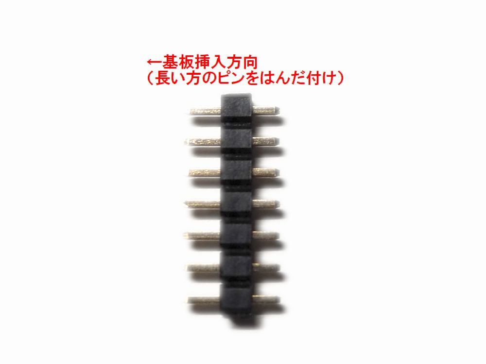

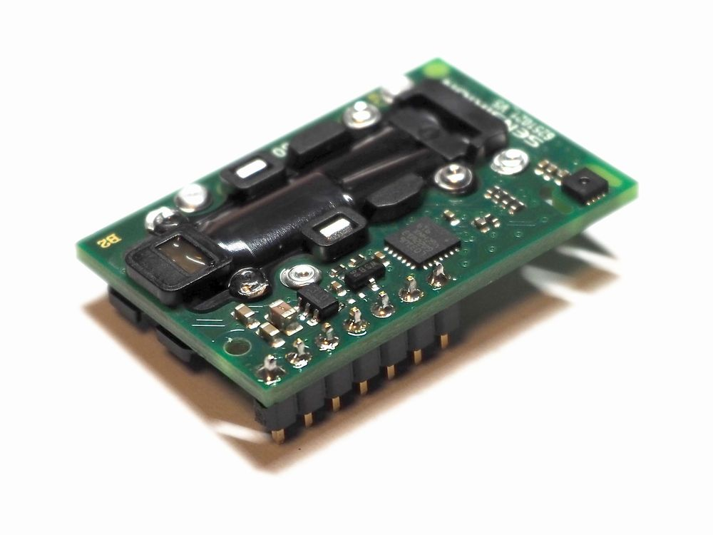

次に、付属のプリント基板にピンヘッダ・ピンソケットをはんだ付けします。  
部品は、シルクのある面から挿入してください。  
7ピンの穴にピンソケットが、8ピンの穴にL字のピンヘッダが入ります。

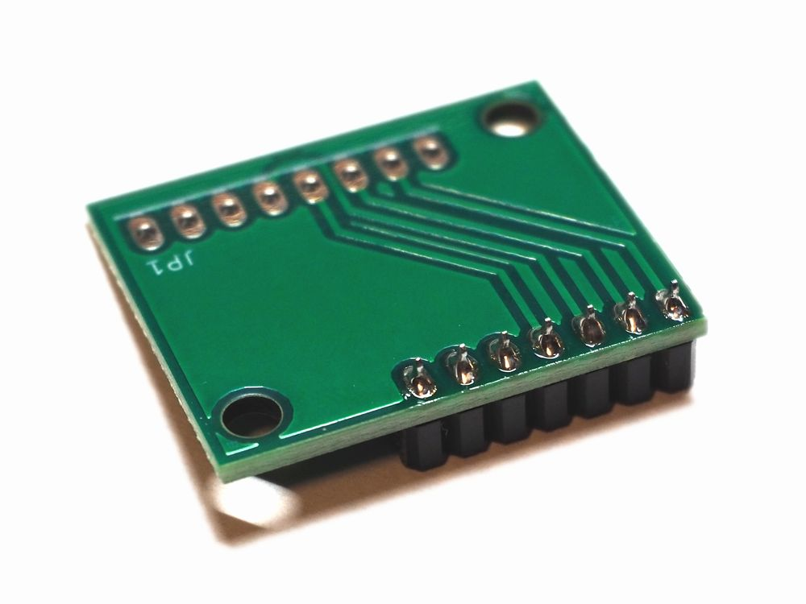
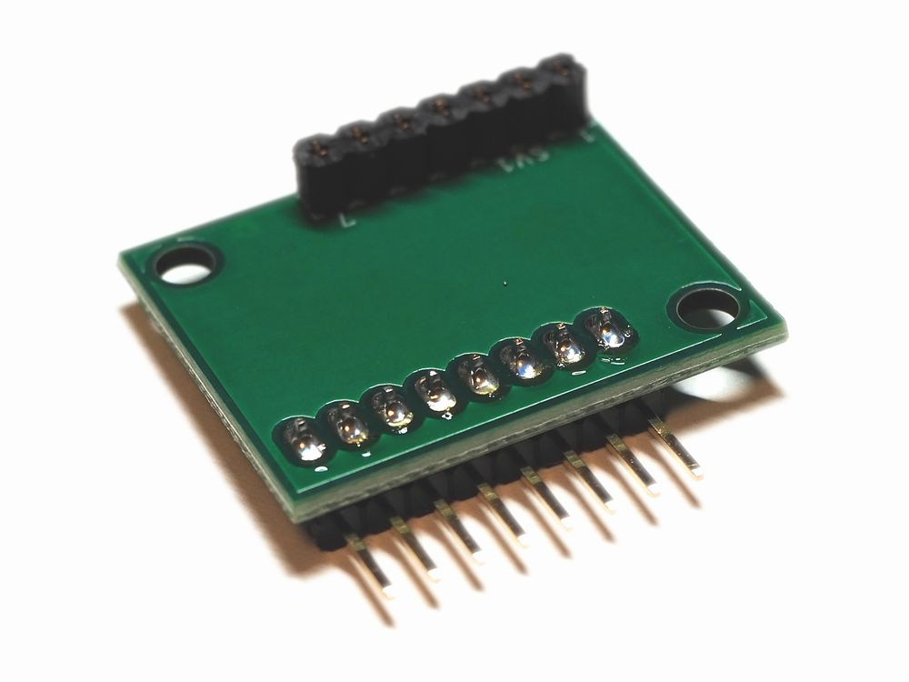

はんだ付けが終わったら、キットを組み立てていきます。  
写真のように、背面側の筐体にプリント基板をネジ止めします。筐体は3Dプリンタで印刷しているため、タッピングビスでネジ止めする際は強く締めすぎないよう注意してください。

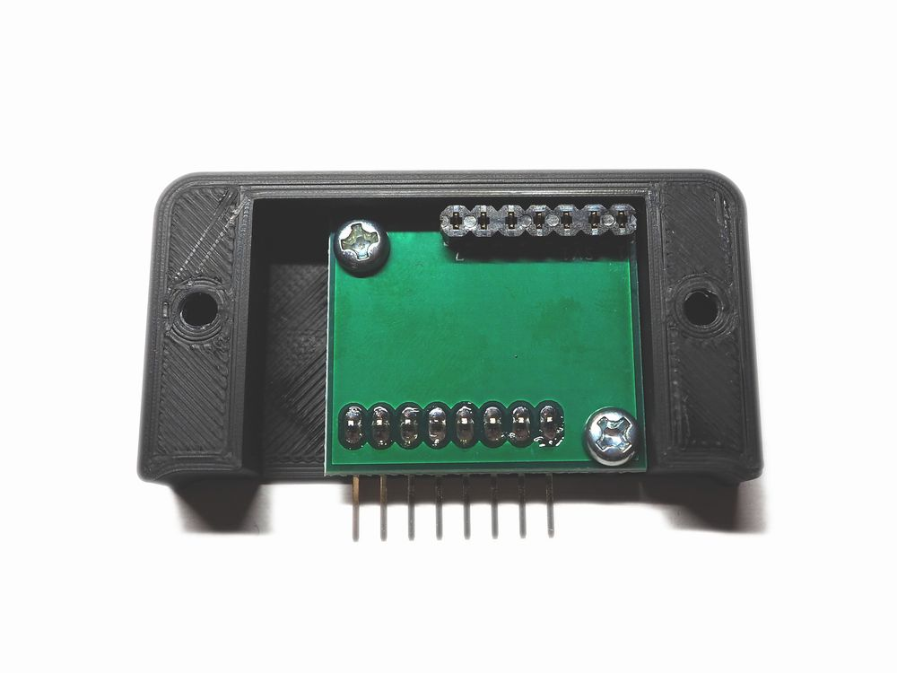

プリント基板のネジ止めができたら、センサ基板を接続します。

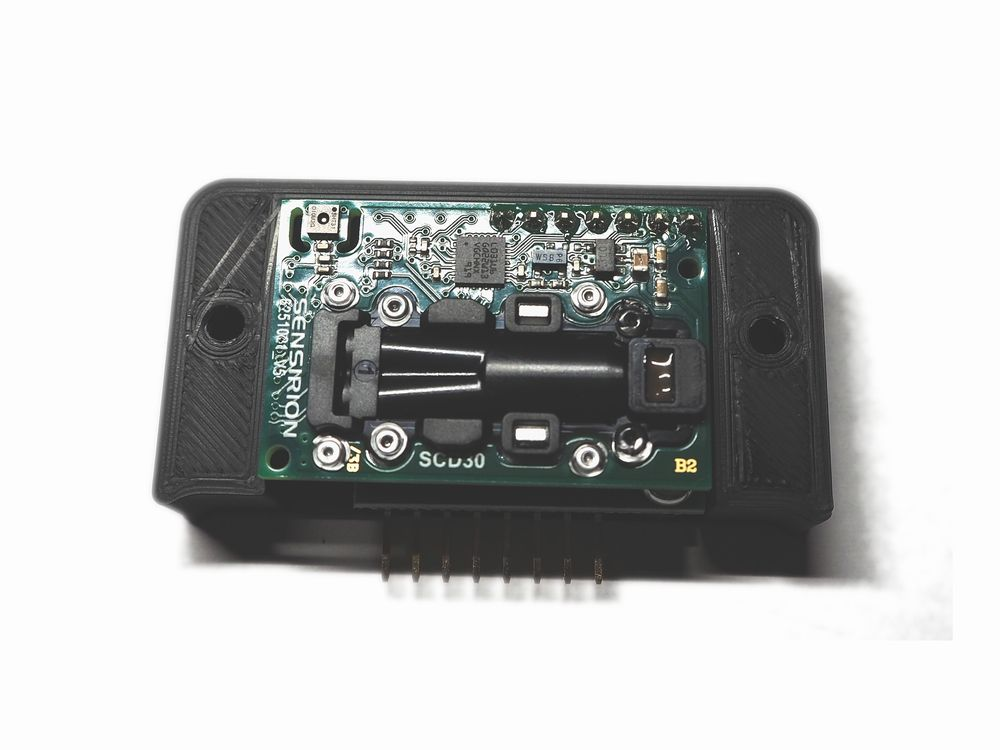
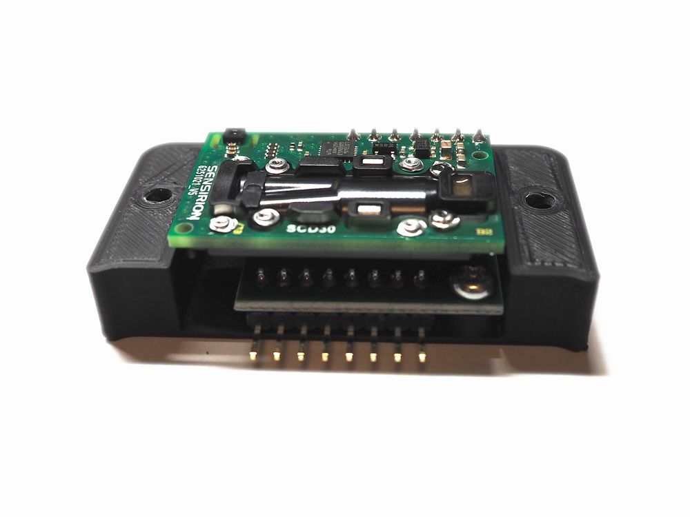

正面側の筐体を取り付けます。  
背面側からタッピングビスで筐体同士をネジ止めします。タッピングビスでネジ止めする際は強く締めすぎないよう注意してください。

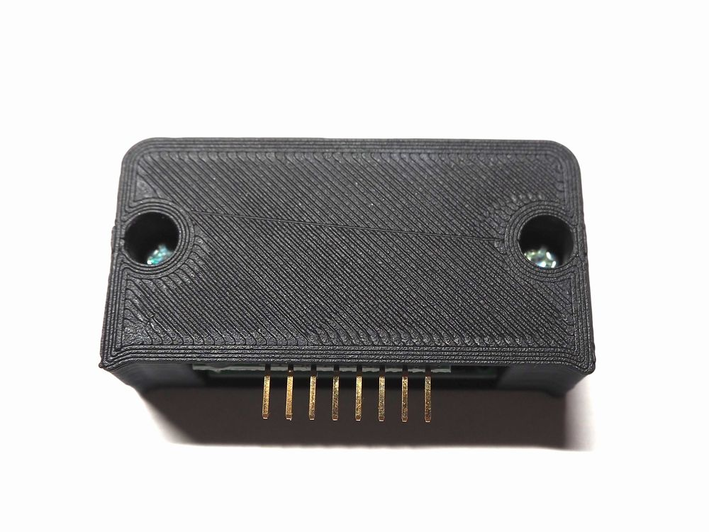

キットの組立てが完了しました。M5Stack上面の端子にピンヘッダを挿入して完成です。

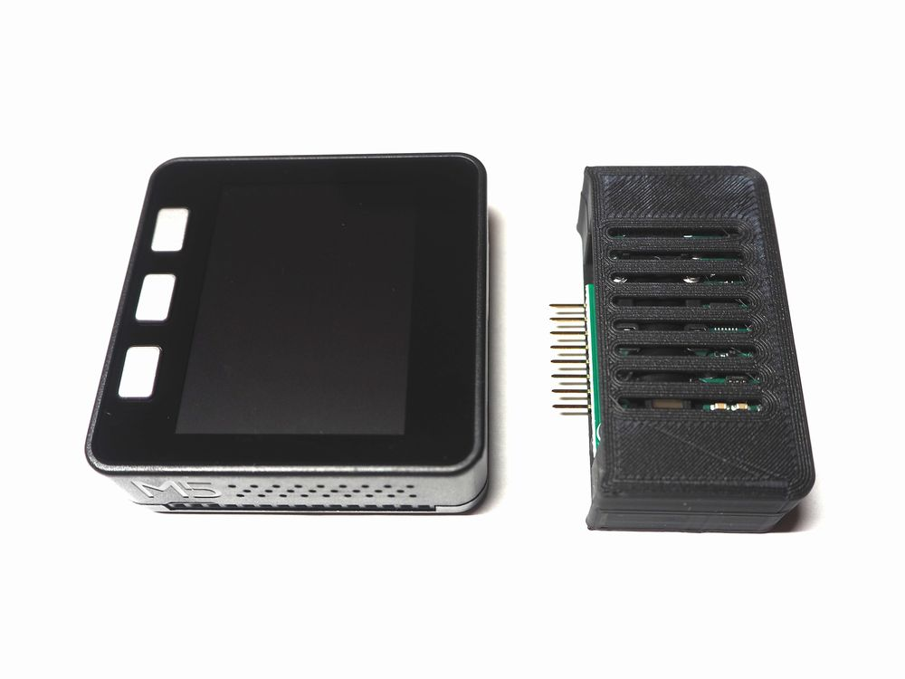
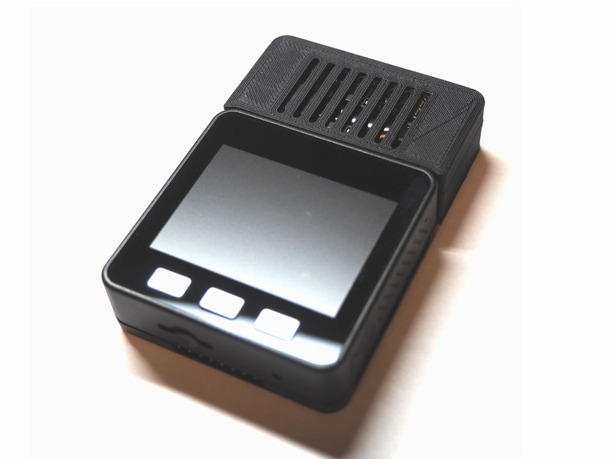

# ソフトウェアの書き込み

M5Stackには本リポジトリのアプリケーション（main.cpp）を書き込んでください。  
書き込みはvscode+platform.ioを使って動作確認しています。

※ArduinoIDEを使って書き込む場合は、main.cppをmain.inoに拡張子を変更して開いてください。

**ライブラリ等バージョン情報（PlatformIOビルドメッセージより）**
```
PLATFORM: Espressif 32 (3.3.2) > M5Stack Core ESP32
HARDWARE: ESP32 240MHz, 320KB RAM, 4MB Flash
DEBUG: Current (esp-prog) External (esp-prog, iot-bus-jtag, jlink, minimodule, olimex-arm-usb-ocd, olimex-arm-usb-ocd-h, olimex-arm-usb-tiny-h, olimex-jtag-tiny, tumpa)
PACKAGES:
 - framework-arduinoespressif32 3.10006.210326 (1.0.6)
 - tool-esptoolpy 1.30100.210531 (3.1.0)
 - tool-mkspiffs 2.230.0 (2.30)
 - toolchain-xtensa32 2.50200.97 (5.2.0)
LDF: Library Dependency Finder -> http://bit.ly/configure-pio-ldf
LDF Modes: Finder ~ chain, Compatibility ~ soft
Found 32 compatible libraries
Scanning dependencies...
Dependency Graph
|-- <M5Stack> 0.3.6
|   |-- <FS> 1.0
|   |-- <SPIFFS> 1.0
|   |   |-- <FS> 1.0
|   |-- <SPI> 1.0
|   |-- <HTTPClient> 1.2
|   |   |-- <WiFi> 1.0
|   |   |-- <WiFiClientSecure> 1.0
|   |   |   |-- <WiFi> 1.0
|   |-- <Wire> 1.0.1
|   |-- <SD(esp32)> 1.0.5
|   |   |-- <FS> 1.0
|   |   |-- <SPI> 1.0
|-- <SparkFun SCD30 Arduino Library> 1.0.14
|   |-- <Wire> 1.0.1
|-- <Ambient ESP32 ESP8266 lib> 1.0.1
|   |-- <WiFi> 1.0
|-- <Preferences> 1.0
|-- <WiFi> 1.0
|-- <WiFiClientSecure> 1.0
|   |-- <WiFi> 1.0
|-- <Wire> 1.0.1
```
# 操作方法

本キットをM5Stackに接続し、電源を入れます。  
正しく電源が入ると初期メッセージが3秒程度表示されます。

その後、自動的に計測表示画面に遷移します。

計測値は約2秒ごとに更新されます。二酸化炭素濃度のグラフは横幅いっぱいで過去の約10分程度の履歴を表しています。

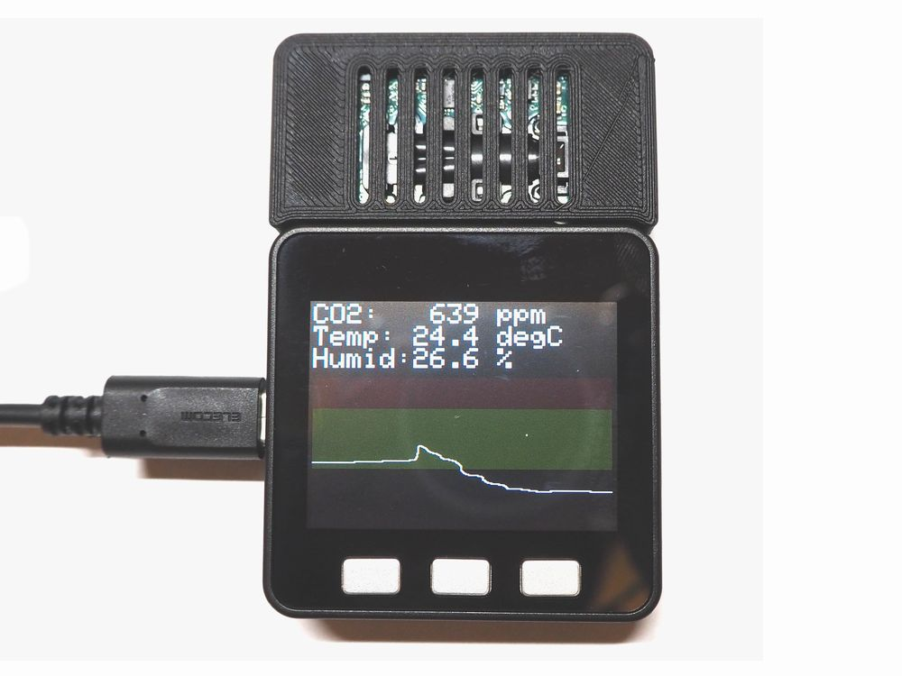

# 設定画面

計測表示画面でM5Stackの画面下のいずれかのボタンを長押しすると設定画面に遷移します。ここでは二酸化炭素濃度の注意・警告レベルの設定や、センサの校正が可能です。

中央ボタンを押すと下の項目に移動します。一番下の項目で中央ボタンを押すと計測表示画面に戻ります。
選択された項目で左右のボタンを押すと設定値を変更できます。

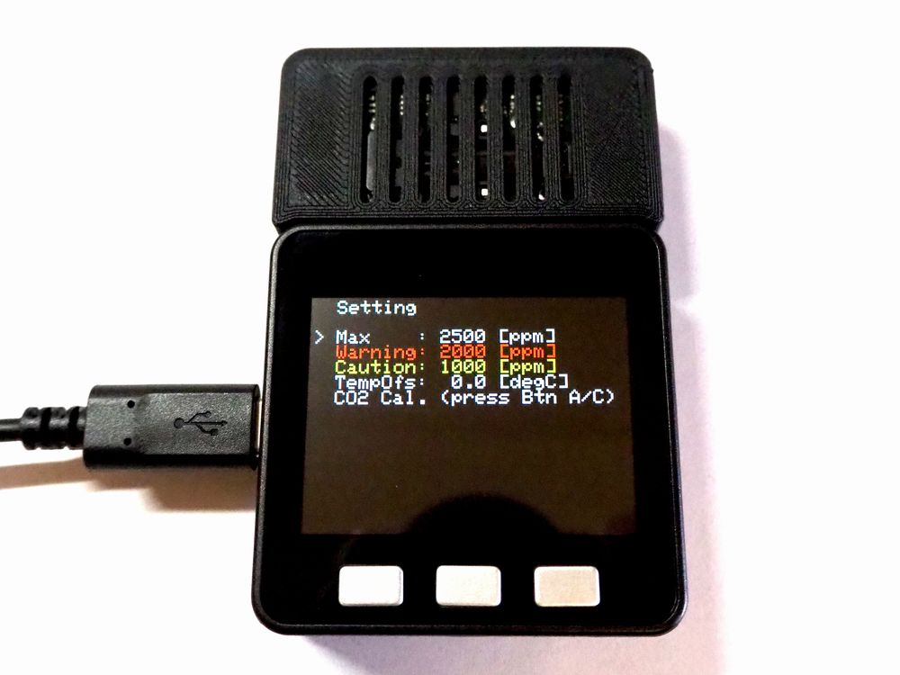

| 設定項目 |                          概要                          |
| :------: | :----------------------------------------------------: |
|   Max    |               グラフエリアの表示最大濃度               |
| Warning  | 二酸化炭素濃度の警告レベル（グラフの赤色エリアの下限） |
| Caution  | 二酸化炭素濃度の注意レベル（グラフの黄色エリアの下限） |
| TempOfs  |                温度センサオフセット設定                |
| CO2 Cal. |                 二酸化炭素センサの校正                 |


# センサの校正

センサは輸送中の振動やはんだ付けの加熱などにより、特性が若干変動する場合があります。
そのため、使用前にご自身でセンサの校正を行うことをおすすめします。

## 二酸化炭素センサの校正
屋外の二酸化炭素濃度は概ね400ppmのため、これを基準に校正を行います。
M5Stackに本キットを接続し、電源を入れた状態で屋外または換気が十分に効いた屋内に静置し、二酸化炭素濃度が落ち着くまで待ちます。（空気の通りが場所に置いてください、直射日光が当たる場所は避けてください）

二酸化炭素濃度の表示が落ち着いて2分以上経ったら、設定画面からCO2 Cal.を選択します。

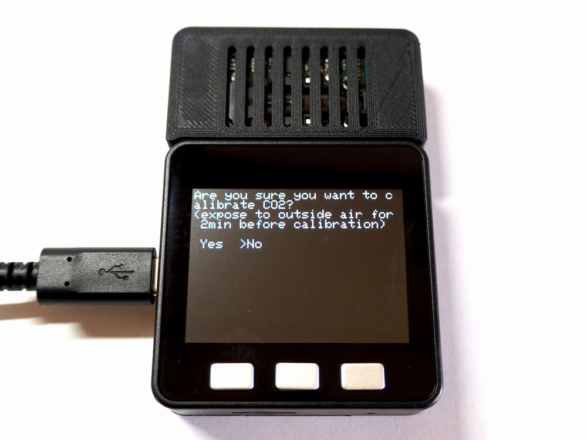

確認画面が出ますので、Yesを押します。その瞬間のCO2濃度が400ppmとして校正されます。

## 温湿度センサの校正
本キットに使用しているセンサは、自己発熱などにより実際の温度より高い温度が表示される場合があります。
その場合自己発熱分の温度オフセットをセンサに設定することで正しい値を表示することができます。

別途温度計などの基準を用意してください。
基準となる温度と表示に差がある場合は、その差分をTempOfsに設定します。

例えば、温度計の温度が20.0℃、M5Stackで表示される温度が23.0℃の場合はTempOfsに3.0degCを設定します。（※出荷時には4.0degCで設定されています）

設定値は再起動後有効になるため、一度電源を落として再起動してください。
センサ内部でローパスフィルタが入っているため、オフセット値が実際に効いてくるのには時間がかかります。

# オプション機能

Wifi環境に接続の上、別売りのMicroSDカードに設定を書き込み、M5Stackに挿入して起動することで、オプション機能が使えます。
設定ファイルは、本リポジトリの[config.ini](config.ini)をダウンロードしてお使いください。

config.iniの中身は以下のようになっています。

```ini
###########################
#    Config.ini
###########################


#WIFI_SSID
YOUR_WIFI_SSID

#SSID_PASS
YOUR_WIFI_PASSWORD

#AMBIENT_CH_ID
YOUR_AMBIENT_CH_ID

#AMBIENT_WRITEKEY
YOUR_AMBIENT_WRITEKEY

#PUSHBULLET_APIKEY
YOUR_PUSHBULLET_APIKEY
```

## Wifiへの接続

[config.ini](config.ini)をダウンロードし、WIFI SSIDとパスワードを書き込んでください。


## Ambient

本キットは[Ambient](https://ambidata.io/)のサービスと連携することができます。
Ambientを利用することで、外部からスマートフォンなどを使って過去のセンサ値の履歴を確認することができます。

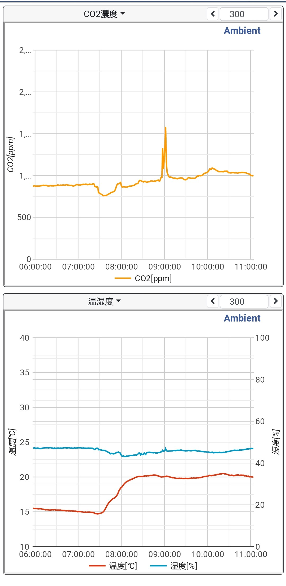

Ambientでアカウント、チャンネルを作成します。アカウント作成などの詳細は[Ambientチュートリアル](https://ambidata.io/docs/)をご参照ください。
アカウント、チャンネルが作成できたら、[config.ini](config.ini)をダウンロードし、AmbientのチャンネルIDとWRITE KEYを書き込んでください。

## Pushbullet

本キットは[Pushbullet](https://www.pushbullet.com/)のサービスと連携することができます。
Pushbulletを利用することで、設定した二酸化炭素濃度を超えたときにスマートフォンにプッシュ通知を送ることができます。


Pushbulletでアカウント、API KEYを作成します。
作成できたら、[config.ini](config.ini)をダウンロードし、PushbulletのAPIKEYを書き込んでください。

### Ambient/Pushbulletのいずれかのみを使用する場合
もし、片方のみのサービスを使う場合は、使わない方の設定をconfig.iniから削除してください。

（Ambientのみを使う場合：Pushbullet関連設定を削除）
```ini
###########################
#    Config.ini
###########################


#WIFI_SSID
YOUR_WIFI_SSID

#SSID_PASS
YOUR_WIFI_PASSWORD

#AMBIENT_CH_ID
YOUR_AMBIENT_CH_ID

#AMBIENT_WRITEKEY
YOUR_AMBIENT_WRITEKEY

```

（Pushbulletのみを使う場合：Ambient関連設定を削除）
```ini
###########################
#    Config.ini
###########################


#WIFI_SSID
YOUR_WIFI_SSID

#SSID_PASS
YOUR_WIFI_PASSWORD

#PUSHBULLET_APIKEY
YOUR_PUSHBULLET_APIKEY

```

### ソースコードを直接編集して設定する方法（プログラミングがわかる人向け）
外部サービスと連携する場合、基本は外付けのMicroSDカードに設定を書き込んで使用しますが、
直接ソースコードの設定部分を書き換えることも可能です。その場合、MicroSDカードは必要ありません。

直接ソースコードを書き換えて外部サービスと連携する場合は、main.cppの以下の部分を編集してください。

1. SDカードの読み込み、使用サービスの設定
`#define USE_EXTERNAL_SD_FOR_CONFIG`をコメントアウトし、使用するサービスのコメントアウトを外してください。

```C
// #define USE_EXTERNAL_SD_FOR_CONFIG
// comment out USE_EXTERNAL_SD_FOR_CONFIG if you write config directly, and define config you use
#define USE_AMBIENT  // comment out if you don't use Ambient for logging
#define USE_PUSHBULLET  // comment out if you don't use PushBullet for notifying
```

上のように書くとAmbientとPushbulletの両方を使う設定になります。

2. Wifi設定
WIFI SSID,　パスワードを書き込んでください。
```C
// WiFi setting
#if defined(USE_AMBIENT) || defined(USE_PUSHBULLET)
bool use_wifi = true;
const char *ssid{"Write your ssid"};          // write your WiFi SSID (2.4GHz)
const char *password{"Write your password"};  // write your WiFi password
```

3. Ambient設定（Ambientを使用する場合）
Ambientの設定を書き込んでください。
```C
#ifdef USE_AMBIENT
bool use_ambient = true;
unsigned int channelId{99999};                         // write your Ambient channel ID
const char *writeKey{"Write your Ambient write key"};  // write your Ambient write key
```

4. Pushbullet設定（Pushbulletを使用する場合）
Pushbulletの設定を書き込んでください。
```C
#ifdef USE_PUSHBULLET
bool use_pushbullet = true;
String pushbullet_apikey("Write your pushbullet api key");
```

# その他
- 医療用途や工業用途には使用しないでください。
- 冷蔵庫に貼り付けて使うと、M5Stackのスピーカからノイズが出る場合があります。その時は、M5StackのGNDと25ピンを短絡してください。

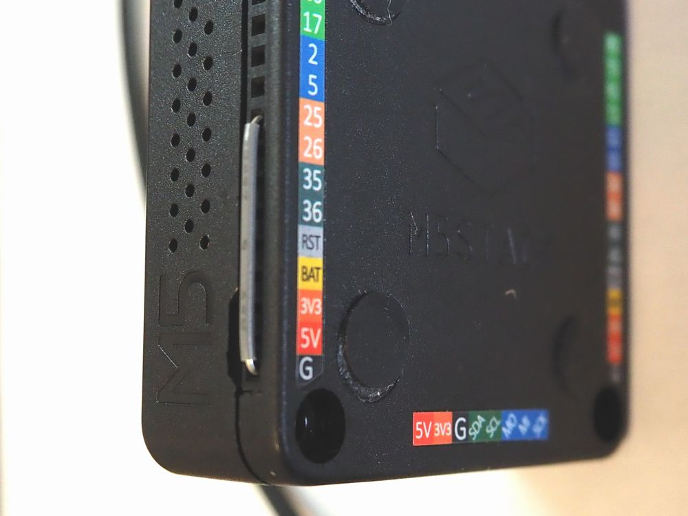

# Author

水田かなめ（[@kmizta](https://twitter.com/kmizta)）  
Twitterやってます。
本リポジトリの更新などはTwitterにてお知らせします。

[](https://twitter.com/kmizta)
 
本キットに対する問い合わせはTwitterDMまたは[メール](<mailto:kanamemizuta@gmail.com>)まで。
